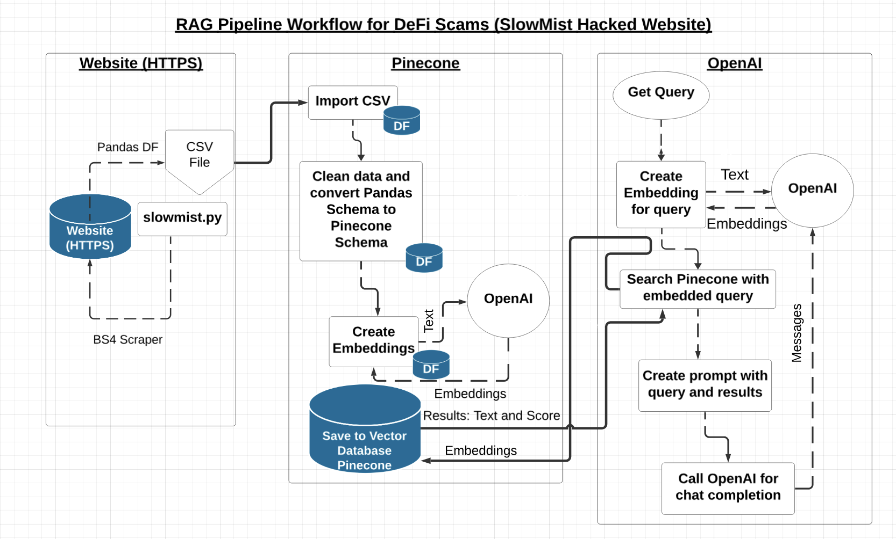

# Retrieval Augmented Generation Engine using OpenAI API, Gradio, & Pinecone

[DEMO LINK!](https://youtu.be/pt200tFT85A)



## Overview

The Retrieval Augmented Engine (RAG) is a powerful tool for document retrieval, summarization, and interactive question-answering. This project utilizes Gradio for front-end, OpenAI API to create embeddings and obtain chat completion response, Pinecone to store embeddings, and BeautifulSoup along with Pandas to scrape and preprocess data. The aim of this project is to provide a seamless web application for chatting with a chatbot about DeFi (Decentralized Finance) scams, ultimately aiming to educate them about the prevalent threats within the DeFi space.

Two open-source databases, including [DEFIYIELD](https://de.fi/rekt-database) and [SlowMist](https://hacked.slowmist.io/), are used to train the chatbot. Specifically, one of the scraped fields that describes the summary of an attack is used to generate vector embeddings for the documents. The vector embeddings are then stored in Pinecone, a vector database, for efficient retrieval and question-answering tasks.

## Features

- **Gradio Web App**: The front-end is built using Gradio, providing a seamless and interactive user experience with a chatbot.
- **Text Splitting**: The combined scam database is split into smaller text chunks, ensuring compatibility with models with token limits.
- **Vector Embeddings**: The text chunks are converted into vector embeddings, making it easier to perform retrieval and question-answering tasks.
- **Flexible Vector Storage**: You can choose to store vector embeddings either in Pinecone or a local vector store, providing flexibility and control. Chroma DB was used before Pinecone integration in an attempt to store vector embeddings locally; however, Pinecone was chosen for its scalability and retrieval efficiency. Note: you may have to activate a free trial ($100 credit) to upsert data to your Pinecone account.
- **Interactive Conversations**: Users can engage in interactive conversations with the database, asking questions and receiving answers. The chat history is preserved for reference.

## Prerequisites

- Python 3.10.6
- Virtual environment (recommended)
- Visual Studio Code (recommended for environment setup)

## Setup Instructions

### 1. Clone the Repository

Start by cloning this repository to your local machine.

### 2. Create a Python Virtual Environment

It is recommended to run the project within a Python virtual environment to manage dependencies effectively.

- **Using Visual Studio Code**: Click on `View`, then Click on `Command Palette`, search for `Python: Create Environment`, or use the shortcut `Command+Shift+P` and search for the same option.
- **Using Terminal**:

```bash
python3 -m venv venv
source venv/bin/activate  # On Windows use `venv\Scripts\activate`
```

### 3. Install Dependencies

After activating the virtual environment, install the required dependencies.

```bash
pip install -r requirements.txt
```

### 4. Environment Variables

Create a `.env` file in the root directory of the project to store your API keys and other configurations.

```plaintext
OPENAI_API_KEY=<your_openai_api_key>
PINECONE_API_KEY=<your_pinecone_api_key>
```

## Running the Applications

### Scrape Data from SlowMist Hacked Database

To scrape and save data as `CSV` locally, run the following command:
Review the `main` function of the application to understand the flow of the application.

```bash
python slowmist.py
```

### Run Pinecone and OpenAI Application

To execute the Pinecone and OpenAI integration:
Review the main function of the application to understand the flow of the application.

```bash
python app.py
```

## Contributors

[Tegveer Ghura](https://github.com/TegveerG)

## Contact

If you have any questions, suggestions, or would like to discuss this project further, feel free to get in touch with me:

- [Email](mailto:tegu99@gmail.com)
- [LinkedIn](https://www.linkedin.com/in/tegveerg/)

I'm open to collaboration and would be happy to connect!
